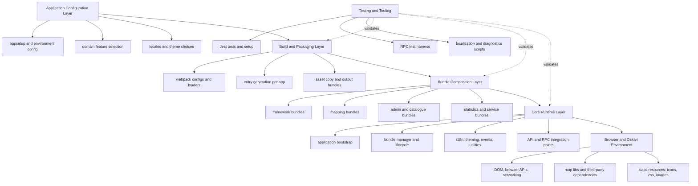
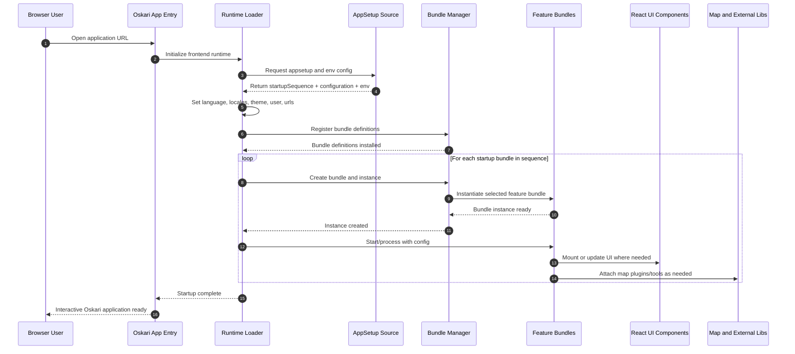
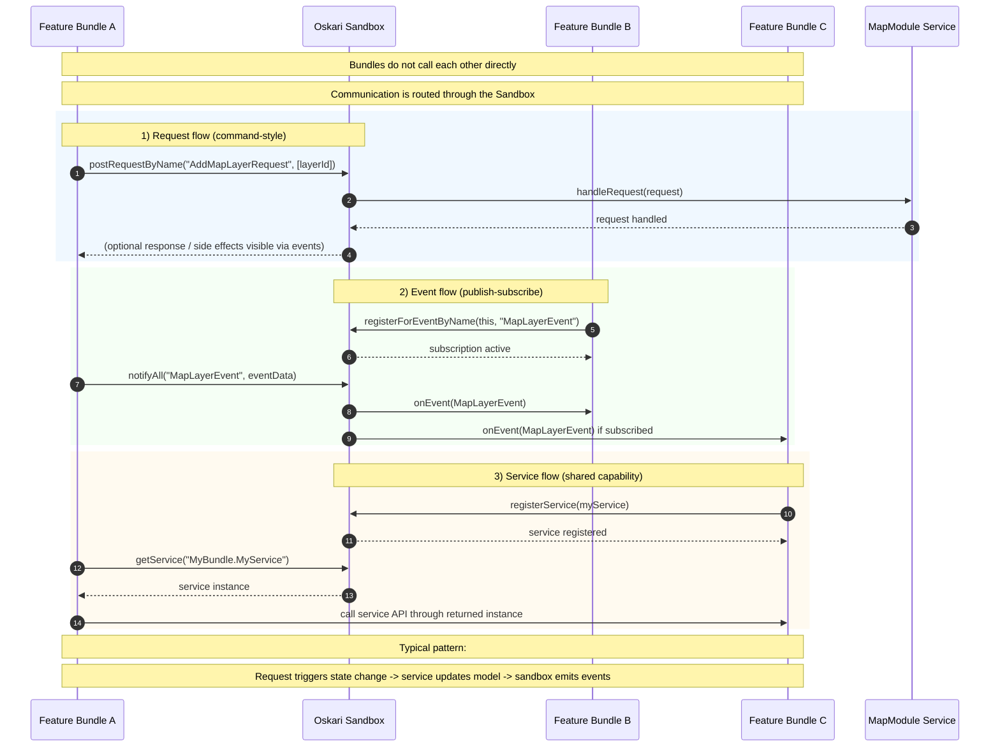

# Oskari Frontend Repository Description

This repository is the core frontend platform for Oskari-based applications. It provides the runtime framework, modular feature bundles, shared UI components, public frontend API structures, and the build/test tooling used to assemble and run Oskari applications.

## Purpose

Oskari is a framework for building feature-rich web map applications. This repository contains the frontend side of that ecosystem, including:

- Core frontend framework code
- Reusable bundles and plugins for application functionality
- Webpack-based build pipeline for Oskari applications
- Testing, localization, and maintenance tooling

## Main Contents

### 1. Core runtime framework

The core runtime is under the src folder and includes application bootstrapping, configuration handling, language and locale setup, user and theme wiring, and runtime service infrastructure.

Key responsibilities include:

- Loading application setup and environment configuration
- Starting bundle startup sequences
- Managing global frontend state and utilities
- Providing extension points for Oskari-based apps

### 2. Bundle library

Most end-user functionality is implemented as modular bundles, grouped by domain such as:

- framework
- mapping
- admin
- catalogue
- statistics
- service

These bundles act as building blocks for composing complete Oskari applications, including map tools, layer handling, search, analytics, publishing, and domain-specific UI features.

### 3. Public API structure and changelog

The api folder documents and organizes frontend API-level entities by domain, including framework and mapping related APIs.

The API changelog tracks additions, modifications, removals, RPC impact, and breaking changes, helping integrators and developers manage version upgrades safely.

### 4. UI component layer

Shared React-based UI components are in the React UI folder and are designed around Ant Design. This provides reusable UI primitives and common frontend patterns for bundle and app development.

### 5. Build and packaging system

The repository includes a full Webpack toolchain and supporting scripts for building app-specific frontend outputs.

Build logic includes:

- Generating entries per application setup
- Copying static resources and assets
- Producing distributable JS/CSS bundles
- Supporting both development and production workflows

### 6. Resources and included libraries

Shared static assets are maintained under resources, and bundled third-party libraries are included for compatibility and controlled usage in Oskari environments.

### 7. Testing and tooling

Testing infrastructure is based on Jest, with utilities for component and runtime testing. Additional scripts and tools support:

- Localization extraction and injection
- Bundle and locale validation
- Development mode helpers
- Diagnostics and tracing

## Architectural Summary

At a high level:

- src is the frontend kernel/runtime
- bundles provides modular feature implementations
- api defines and tracks public contract changes
- webpack and root configs drive build/distribution
- tests and tools support quality and maintainability

Together, these make this repository the central frontend framework and component/bundle library for building JavaScript applications on top of Oskari.

## Layered architecture diagram

## Startup sequence diagram

## Bundle communication

